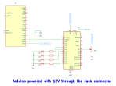

# GENERAL REFERENCE DEMO - DOCUMENTATION

## 1. What the Demo Does

The **General Reference Demo** is designed to showcase the integration of various components of the **display** using the **Lumen Protocol**. This demo provides interactive control and real-time feedback for:
- **LED control**
- **Curve simulation**
- **Pressure monitoring**
- **Volume adjustment**
- **QR code text processing**

Through the display, users can send commands and receive real-time data, demonstrating the **communication** capabilities of the system.

## 2. Purpose

The primary goal of this project is to demonstrate **seamless communication between the display and multiple hardware components**, emphasizing:
- **Real-time data exchange** for LED control, pressure monitoring, and volume adjustments.
- **Interactive curve simulations** using ECG and sine wave data.
- **Processing of QR code text** with inversion functionality.
- **Dynamic user interface updates** based on received sensor data.

This demo highlights the display’s ability to **control and visualize multiple data sources simultaneously**, making it ideal for medical, industrial, and interactive applications.

## 3. How to Use

### 3.1 Setting Up the Hardware

1. **Connect LEDs to the Arduino**:
   - **LED 1** → **Pin 5**
   - **LED 2** → **Pin 6**
   - **LED 3** → **Pin 7**
   - **LED 4** → **Pin 8**

2. **Connect Analog Sensor (Potentiometer) to Arduino**:
   - **Sensor Output** → **Analog Pin A0**

3. **Connect the display** to the Arduino via a serial connection.

### 3.2 Interactive Features

This demo allows users to **interact with the display** to:
1. **Control LEDs individually or in groups**:
   - Toggle individual LEDs ON/OFF.
   - Set all LEDs to HIGH or LOW.
   - Toggle all LEDs at once.

2. **Simulate Graph Data**:
   - **ECG Curve Simulation**: Sends predefined ECG wave data to the display.
   - **Sine Wave Simulation**: Generates and sends a sine wave.

3. **Monitor Pressure Data**:
   - Reads an analog pressure sensor and **converts the value** for display visualization.
   - Activates an **alarm** when pressure exceeds a set threshold.

4. **Adjust Volume**:
   - Users can send **volume levels** from the display.
   - A **bar graph updates dynamically** to reflect the current volume.

5. **Process QR Code Text**:
   - The display sends **text data** for QR code generation.
   - The system **reverses the text** and sends it back for display.

## 4. Schematic Circuit

Below is the **schematic circuit** for the General Reference Demo:



## 5. Functionality Explanation

1. **Real-Time Communication**:
   - Uses the **Lumen Protocol** for serial communication.
   - Sends and receives packets for **LED control, curve simulation, pressure monitoring, and text processing**.

2. **LED Control**:
   - Users can control **individual LEDs** or manage them **in groups** via the display.

3. **Graph Simulation**:
   - Supports **ECG waveform simulation** with predefined sample points.
   - Generates **sine wave** values dynamically.

4. **Pressure Monitoring**:
   - Reads pressure values, **converts them to display-friendly units**, and **triggers alarms** if needed.

5. **Volume Adjustment**:
   - Updates **bar graphs dynamically** as volume levels change.

6. **QR Code Processing**:
   - Receives text, **reverses the string**, and sends it back to the display.

## 6. Code Overview

    ```cpp
    #include "LumenProtocol.h"

    extern "C" void lumen_write_bytes(uint8_t* data, uint32_t length) {
      Serial.write(data, length);
    }

    extern "C" uint16_t lumen_get_byte() {
      if (Serial.available()) {
        return Serial.read();
      }
      return DATA_NULL;
    }

    // LED screen variables
    const int ledControlsToggleLed1 = 611;
    const int ledControlsToggleLed2 = 612;
    const int ledControlsToggleLed3 = 613;
    const int ledControlsToggleLed4 = 614;
    const int ledControlsSetAllLedsToLow = 615;
    const int ledControlsToggleAllLeds = 616;
    const int ledControlsSetAllLedsToHigh = 617;

    const int ledPin1 = 5;  // Pin for LED 1
    const int ledPin2 = 6;  // Pin for LED 2
    const int ledPin3 = 7;  // Pin for LED 3
    const int ledPin4 = 8;  // Pin for LED 4

    // User Variable Address
    const uint16_t navigationButtonsAddress = 119;
    const uint16_t ledControlsAddress = 600;
    const uint16_t var_ledSwitchIcon1Address = 601;
    const uint16_t var_ledSwitchIcon2Address = 602;
    const uint16_t var_ledSwitchIcon3Address = 603;
    const uint16_t var_ledSwitchIcon4Address = 604;

    const uint16_t curveSimulationSampleButtonsAddress = 400;

    const int curveSimulationSampleEcg = 410;
    const int curveSimulationSampleSine = 411;

    const int curveNumberOfPoints = 216;  // Maximum number of points for curve simulation

    const int ecgSamplePoints[] = {  // Sample ECG data
      39, 39, 39, 39, 39, 39, 39, 39, 39, 39, 39, 39, 39, 40, 41, 44, 47, 50, 52, 52, 48, 43, 41, 39, 39, 39, 37, 33, 38,
      45, 60, 75, 90, 100, 94, 80, 63, 46, 29, 17, 11, 17, 27, 34, 39, 39, 39, 39, 39, 39, 39, 39, 39, 39, 39
    };

    const int ecgSamplePointsLength = 55;  // Number of points in the ECG sample

    // User Variable Packets
    lumen_packet_t navigationButtonsPacket = { navigationButtonsAddress, kS32 };
    lumen_packet_t ledControlsPacket = { ledControlsAddress, kS32 };
    lumen_packet_t var_ledSwitchIcon1Packet = { var_ledSwitchIcon1Address, kBool };
    lumen_packet_t var_ledSwitchIcon2Packet = { var_ledSwitchIcon2Address, kBool };
    lumen_packet_t var_ledSwitchIcon3Packet = { var_ledSwitchIcon3Address, kBool };
    lumen_packet_t var_ledSwitchIcon4Packet = { var_ledSwitchIcon4Address, kBool };

    const uint16_t var_graphManualAddress = 605;
    lumen_packet_t var_graphManualPacket = { var_graphManualAddress, kS32 };

    const uint16_t var_graphManualPacket2Address = 607;
    lumen_packet_t var_graphManualPacket2 = { var_graphManualPacket2Address, kS32 };

    lumen_packet_t curveSimulationTemperatureIndicatorPacket = { curveSimulationSampleButtonsAddress, kS32 };

    const uint16_t curveA0ControlsAddress = 301;  // Curve A0 control address
    lumen_packet_t curveA0ControlsPacket = { curveA0ControlsAddress, kS32 };

    const uint16_t curveA0TemperatureIndicatorAddress = 606;  // Temperature indicator address
    lumen_packet_t curveA0TemperatureIndicatorPacket = { curveA0TemperatureIndicatorAddress, kS32 };

    bool curveA0IsPlotting = false;
    unsigned long lastCurveA0WriteTime = 0;
    const int curveA0AnalogPin = A0;                    // Analog read pin
    const unsigned long curveA0WriteIntervalInMs = 30;  // Write interval in milliseconds

    const int curveA0ControlPlay = 300;
    const int curveA0ControlPause = 301;
    const int curveA0ControlStop = 302;

    // Variables for pressure reception and alarm control
    const uint16_t var_pressureValueAddress = 608;
    lumen_packet_t var_pressureValuePacket = { var_pressureValueAddress, kS32 };

    const uint16_t var_activateDeactivateAlarmAddress = 609;
    lumen_packet_t var_activateDeactivateAlarmPacket = { var_activateDeactivateAlarmAddress, kBool };

    const uint16_t convertedPressureValueAddress = 612;
    lumen_packet_t convertedPressureValuePacket = { convertedPressureValueAddress, kS32 };

    const uint16_t showHideIconAddress = 610;
    lumen_packet_t showHideIconPacket = { showHideIconAddress, kBool };

    const uint16_t isOpen_TextQRAddress = 613;
    lumen_packet_t isOpen_TextQRPacket = { isOpen_TextQRAddress, kBool };

    const uint16_t var_textQRAddress = 614;
    lumen_packet_t var_textQRPacket = { var_textQRAddress, kString };

    const uint16_t var_invertedTextQRAddress = 615;
    lumen_packet_t var_invertedTextQRPacket = { var_invertedTextQRAddress, kString };

    const uint16_t var_volumeAddress = 619;
    lumen_packet_t var_volumePacket = { var_volumeAddress, kS32 };

    // Variables to store current and previous volume values
    int32_t currentVolume = 0;
    int32_t previousVolume = 0;

    const uint16_t xBarGraphAddress = 617;
    const uint16_t yBarGraphAddress = 618;
    lumen_packet_t xBarGraphPacket = { xBarGraphAddress, kS32 };
    lumen_packet_t yBarGraphPacket = { yBarGraphAddress, kS32 };

    const uint16_t var_keyboardPressureAddress = 629;
    lumen_packet_t var_keyboardPressurePacket = { var_keyboardPressureAddress, kS32 };

    void setup() {
      Serial.begin(115200);

      pinMode(ledPin1, OUTPUT);  // Setup LED 1 pin
      pinMode(ledPin2, OUTPUT);  // Setup LED 2 pin
      pinMode(ledPin3, OUTPUT);  // Setup LED 3 pin
      pinMode(ledPin4, OUTPUT);  // Setup LED 4 pin
    }

    void loop() {
      while (lumen_available() > 0) {
        lumen_packet_t* currentPacket = lumen_get_first_packet();
        
        // Check if the received packet is for LED control
        if (currentPacket->address == ledControlsAddress) {
          int32_t value = currentPacket->data._s32;
          switch (value) {
            case ledControlsToggleLed1:
              lumen_request(&var_ledSwitchIcon1Packet);
              break;
            case ledControlsToggleLed2:
              lumen_request(&var_ledSwitchIcon2Packet);
              break;
            case ledControlsToggleLed3:
              lumen_request(&var_ledSwitchIcon3Packet);
              break;
            case ledControlsToggleLed4:
              lumen_request(&var_ledSwitchIcon4Packet);
              break;
            case ledControlsSetAllLedsToLow:
              var_ledSwitchIcon1Packet.data._bool = LOW;
              lumen_write_packet(&var_ledSwitchIcon1Packet);
              var_ledSwitchIcon2Packet.data._bool = LOW;
              lumen_write_packet(&var_ledSwitchIcon2Packet);
              var_ledSwitchIcon3Packet.data._bool = LOW;
              lumen_write_packet(&var_ledSwitchIcon3Packet);
              var_ledSwitchIcon4Packet.data._bool = LOW;
              lumen_write_packet(&var_ledSwitchIcon4Packet);
              digitalWrite(ledPin1, LOW);
              digitalWrite(ledPin2, LOW);
              digitalWrite(ledPin3, LOW);
              digitalWrite(ledPin4, LOW);
              break;
            case ledControlsToggleAllLeds:
              lumen_request(&var_ledSwitchIcon1Packet);
              lumen_request(&var_ledSwitchIcon2Packet);
              lumen_request(&var_ledSwitchIcon3Packet);
              lumen_request(&var_ledSwitchIcon4Packet);
              break;
            case ledControlsSetAllLedsToHigh:
              var_ledSwitchIcon1Packet.data._bool = HIGH;
              lumen_write_packet(&var_ledSwitchIcon1Packet);
              var_ledSwitchIcon2Packet.data._bool = HIGH;
              lumen_write_packet(&var_ledSwitchIcon2Packet);
              var_ledSwitchIcon3Packet.data._bool = HIGH;
              lumen_write_packet(&var_ledSwitchIcon3Packet);
              var_ledSwitchIcon4Packet.data._bool = HIGH;
              lumen_write_packet(&var_ledSwitchIcon4Packet);
              digitalWrite(ledPin1, HIGH);
              digitalWrite(ledPin2, HIGH);
              digitalWrite(ledPin3, HIGH);
              digitalWrite(ledPin4, HIGH);
              break;
            default:
              break;
          }
        }

        // Check packet related to LED 1
        if (currentPacket->address == var_ledSwitchIcon1Address) {
          bool value = currentPacket->data._bool;
          value = !value;
          var_ledSwitchIcon1Packet.data._bool = value;
          lumen_write_packet(&var_ledSwitchIcon1Packet);
          digitalWrite(ledPin1, value);
        }

        // Check packet related to LED 2
        if (currentPacket->address == var_ledSwitchIcon2Address) {
          bool value = currentPacket->data._bool;
          value = !value;
          var_ledSwitchIcon2Packet.data._bool = value;
          lumen_write_packet(&var_ledSwitchIcon2Packet);
          digitalWrite(ledPin2, value);
        }

        // Check packet related to LED 3
        if (currentPacket->address == var_ledSwitchIcon3Address) {
          bool value = currentPacket->data._bool;
          value = !value;
          var_ledSwitchIcon3Packet.data._bool = value;
          lumen_write_packet(&var_ledSwitchIcon3Packet);
          digitalWrite(ledPin3, value);
        }

        // Check packet related to LED 4
        if (currentPacket->address == var_ledSwitchIcon4Address) {
          bool value = currentPacket->data._bool;
          value = !value;
          var_ledSwitchIcon4Packet.data._bool = value;
          lumen_write_packet(&var_ledSwitchIcon4Packet);
          digitalWrite(ledPin4, value);
        }

        // Check for curve simulation control
        if (currentPacket->address == curveSimulationSampleButtonsAddress) {
          int32_t value = currentPacket->data._s32;
          switch (value) {
            case curveSimulationSampleEcg:
              {
                int ecgSampleIndex = 0;
                for (int i = 0; i <= curveNumberOfPoints; i++) {
                  var_graphManualPacket.data._s32 = ecgSamplePoints[ecgSampleIndex];
                  lumen_write_packet(&var_graphManualPacket);
                  ecgSampleIndex++;
                  if (ecgSampleIndex == ecgSamplePointsLength) {
                    ecgSampleIndex = 0;
                  }
                }
              }
              break;
            case curveSimulationSampleSine:
              {
                float angleInRad = 0;
                double sine;
                const float angleStep = 0.1;

                for (int i = 0; i <= curveNumberOfPoints; i++) {
                  sine = sin(angleInRad);
                  sine = (sine + 1) * 50;

                  var_graphManualPacket.data._s32 = (uint8_t)sine;
                  lumen_write_packet(&var_graphManualPacket);
                  angleInRad += angleStep;
                }
              }
              break;
            default:
              break;
          }
        }

        // Check for curve A0 control
        if (currentPacket->address == curveA0ControlsAddress) {
          int32_t value = currentPacket->data._s32;
          switch (value) {
            case curveA0ControlPlay:
              curveA0IsPlotting = true;
              break;
            case curveA0ControlPause:
              curveA0IsPlotting = false;
              break;
            case curveA0ControlStop:
              for (int i = 0; i < curveNumberOfPoints; i++) {
                var_graphManualPacket2.data._s32 = 0;
                lumen_write_packet(&var_graphManualPacket2);
              }
              curveA0IsPlotting = false;
              break;
            default:
              break;
          }
        }

        // Check pressure value packet
        if (currentPacket->address == var_pressureValueAddress) {
          int32_t pressureValue = currentPacket->data._s32;
          int32_t convertedValue = (pressureValue * 180) / 100;
          
          convertedPressureValuePacket.data._s32 = convertedValue;
          lumen_write_packet(&convertedPressureValuePacket);

          if (convertedValue > 90) {
            var_activateDeactivateAlarmPacket.data._bool = true;
            lumen_write_packet(&var_activateDeactivateAlarmPacket);
          } else {
            var_activateDeactivateAlarmPacket.data._bool = false;
            lumen_write_packet(&var_activateDeactivateAlarmPacket);
            showHideIconPacket.data._bool = false;
            lumen_write_packet(&showHideIconPacket);
          }
        }

        // Check if the packet is related to QR text
        if (currentPacket->address == var_textQRAddress) {
          char receivedText[sizeof(currentPacket->data._string)];
          strncpy(receivedText, currentPacket->data._string, sizeof(receivedText));
          reverseString(receivedText);
          strncpy(var_invertedTextQRPacket.data._string, receivedText, sizeof(var_invertedTextQRPacket.data._string));
          lumen_write_packet(&var_invertedTextQRPacket);
        }

        // Check if the packet is related to volume
        if (currentPacket->address == var_volumeAddress) {
          currentVolume = currentPacket->data._s32;
          if (currentVolume > previousVolume) {
            for (int32_t i = previousVolume + 1; i <= currentVolume; ++i) {
              xBarGraphPacket.data._s32 = i;
              yBarGraphPacket.data._s32 = i;
              lumen_write_packet(&xBarGraphPacket);
              lumen_write_packet(&yBarGraphPacket);
            }
          } else if (currentVolume < previousVolume) {
            for (int32_t i = 50; i > currentVolume; --i) {
              xBarGraphPacket.data._s32 = i;
              yBarGraphPacket.data._s32 = 0;
              lumen_write_packet(&xBarGraphPacket);
              lumen_write_packet(&yBarGraphPacket);
            }
          }
          previousVolume = currentVolume;
        }
      }

      // If the graph is plotting
      if (curveA0IsPlotting) {
        if (lastCurveA0WriteTime < millis()) {
          float value = analogRead(curveA0AnalogPin);
          value = (value * 100) / 1023;

          var_graphManualPacket2.data._s32 = (int32_t)value;
          lumen_write_packet(&var_graphManualPacket2);

          curveA0TemperatureIndicatorPacket.data._s32 = (int32_t)value;
          lumen_write_packet(&curveA0TemperatureIndicatorPacket);

          lastCurveA0WriteTime = millis() + curveA0WriteIntervalInMs;
        }
      }
    }

    // Function to reverse a string
    void reverseString(char* str) {
      int length = strlen(str);
      for (int i = 0; i < length / 2; ++i) {
        char temp = str[i];
        str[i] = str[length - i - 1];
        str[length - i - 1] = temp;
      }
    }
